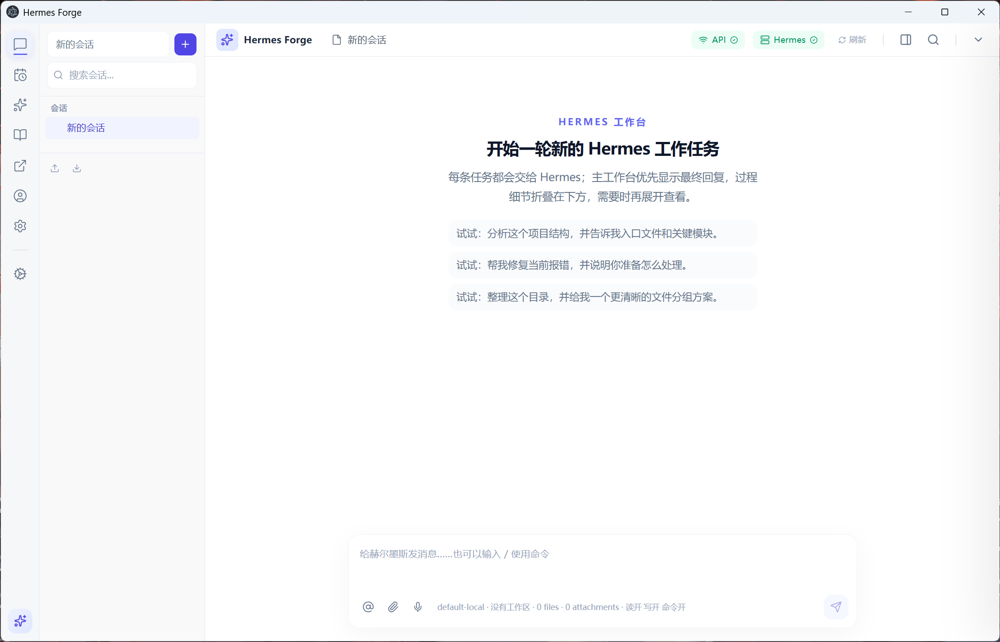

# Hermes Forge

Hermes Forge 是一个面向 Windows 桌面环境的本地优先 Hermes Agent 客户端。它不是简单的聊天壳，而是把 Hermes CLI、模型配置、Windows 原生能力、微信 Gateway、文件附件、权限审批和自动更新整合在一起的桌面工作台。

项目的目标是：让普通用户可以在没有手动配置 Hermes 的情况下完成首次安装与模型接入；也让开发者可以清楚地审计主进程、IPC、权限、日志和运行时边界，继续扩展一个可维护的本地 Agent 客户端。

> Hermes Forge 不是 Hermes Agent 官方客户端，而是围绕 Hermes Agent 桌面体验构建的社区项目。



## 作者与协作邀请

大家好，我是小夏，一名今年刚本科毕业的开发者。Hermes Forge 起初是我为自己日常使用 Hermes Agent、管理本地模型、连接 Windows 原生能力和整理 AI 工作流而搭建的桌面工作台。它还很年轻，但我希望它能慢慢成长为一个真正好用、可信、可审计的本地 Agent 客户端。

这个项目目前主要由我个人在课业、毕业和现实事务之间推进。因为开发过程中大量依赖 AI 编码协作，Token、模型额度和本地算力都会直接限制迭代速度；很多想做的能力，例如更完整的连接器 runtime、更稳定的端到端测试、安装包签名、真实 Windows 物理机兼容性、长期 Gateway 稳定性，还需要更多时间和更多人一起打磨。

如果你也对 Electron、React、Hermes Agent、本地模型、Windows 自动化、Agent 安全边界或个人 AI 工作台感兴趣，欢迎加入一起开发。Issue、Discussion、文档补充、设计建议、真实机器测试、PR 都很有价值。哪怕只是帮忙复现一个问题、整理一段安装经验，也会让这个项目往前走一步。

## 项目定位

Hermes Forge 主要解决三个问题：

1. **降低 Hermes Agent 在 Windows 上的首次使用门槛。**
   应用内置首启体检、Hermes 自动安装、Git/Python/微信依赖检查、模型配置检测和健康状态展示，尽量把“缺什么、怎么修”直接呈现在 UI 中。

2. **把桌面端、Hermes CLI、Gateway 和模型配置统一起来。**
   桌面端保存模型后会同步 Hermes `config.yaml`、`.env` 和 Gateway 运行环境，避免桌面聊天、CLI、微信端各用一套模型或密钥。

3. **为本地 Agent 提供可审计的 Windows 能力边界。**
   文件写入、PowerShell、键鼠、窗口控制等高风险动作统一经过主进程审批服务；Renderer 只通过 preload 暴露的白名单 IPC 与主进程交互。

## 当前状态

当前公开版本为 **v0.1.4**，已经具备可安装、可演示、可继续开发的主链路：

- Windows 安装包已通过 GitHub Releases 发布。
- GitHub Actions 可在 tag 发布时自动构建 Windows 和 macOS 资产。
- `electron-updater` 已接入 GitHub Releases，支持客户端自动检查更新。
- 核心架构已收口为 Hermes 单引擎，不再保留多引擎分叉复杂度。
- 任务事件统一通过 `task:event` 总线传递，便于 UI、日志和审批联动。

它仍然是早期社区版本，不建议当作完全成熟的生产软件看待。尤其是 macOS 包尚未签名，Windows 物理机兼容性、微信真实账号场景、非微信连接器 runtime、安装器签名和 Electron 冒烟测试仍需要继续打磨。

## 功能概览

### 首次启动与自动部署

- 首次运行自动检测 Hermes、Git、Python、winget、模型配置、微信 `aiohttp` 依赖和用户数据目录权限。
- 未检测到 Hermes 时，可在应用内自动克隆 Hermes Agent、安装 Python 依赖并进行健康检查。
- Git、Python、微信依赖缺失时，系统状态页和欢迎页会给出原因、建议和一键修复入口。
- 自动安装过程会写入诊断日志，失败时不会导致客户端崩溃。

### Hermes 运行与任务工作台

- 以 Hermes 为唯一执行引擎，避免多引擎配置带来的行为不一致。
- 支持流式任务状态、stdout/stderr、工具调用、审批事件、usage 和最终结果展示。
- 支持会话、工作区、文件快照、工作区锁和附件副本管理。
- 支持拖拽上传文件或图片，让用户把本地资料直接带入任务上下文。

### 模型配置与同步

- 支持 OpenAI-compatible 本地服务、OpenRouter、Anthropic、自定义 provider profile 等配置形态。
- 支持连接测试、默认模型配置和密钥引用。
- 模型配置会同步到 Hermes CLI 与 Gateway 运行环境，减少“桌面端改了模型，但微信端还在用旧模型”的问题。
- 针对 `pwd` 这类本地模型短 API key，内置本机代理兼容层，避免 Hermes 将短 key 误判为占位密钥。

### Windows 桥接与安全审批

- Windows 桥接能力覆盖文件、PowerShell、剪贴板、截图、窗口、键鼠和 AutoHotkey 相关基础操作。
- 高风险动作统一由主进程审批服务处理，支持 `once`、`session`、`always`、`deny` 和超时治理。
- Renderer 无法直接读取明文凭据或执行系统命令，敏感能力集中在主进程白名单 IPC 中。
- Session 日志与诊断导出会尽量脱敏 token、密钥和本地敏感信息。

### Gateway 与微信连接器

- Gateway 状态区分配置状态、运行状态、健康状态、退出码、重启次数和退避时间。
- 微信扫码登录具备主进程状态机，覆盖二维码获取、等待扫码、等待确认、保存、同步、启动 Gateway、成功、超时、失败和取消。
- 微信依赖缺失时会提供可恢复提示与修复入口。
- 其他平台连接器已具备配置模型，但真实 runtime adapter 仍在路线图中。

### 发布与自动更新

- 使用 `electron-builder` 打包 Windows NSIS / portable 和 macOS dmg / zip。
- 使用 `electron-updater` + GitHub Releases 实现启动后静默检查、后台下载、进度 IPC 和下载完成重启提示。
- GitHub Actions 在推送 `v*` tag 时自动构建并上传 Release 资产。

## 下载与安装

前往 [Releases](https://github.com/Mahiruxia/hermes-forge/releases) 下载最新版本。

- Windows 用户下载 `Hermes.Forge.Setup.x.y.z.exe`。
- macOS Apple Silicon 用户可下载 `Hermes.Forge-x.y.z-arm64.dmg`。
- `latest.yml`、`latest-mac.yml`、`*.blockmap` 是自动更新元数据，普通用户不需要手动下载。

注意：当前安装包尚未进行商业代码签名。Windows 或 macOS 首次打开时可能出现系统安全提示，这是早期独立开发版本的正常限制。

## 本地开发

推荐环境：

- Windows 10/11
- Node.js 20+
- npm
- Git
- Python 3.10+

克隆并启动：

```bash
git clone https://github.com/Mahiruxia/hermes-forge.git
cd hermes-forge
npm install
cp .env.example .env
npm run dev
```

Windows PowerShell:

```powershell
git clone https://github.com/Mahiruxia/hermes-forge.git
cd hermes-forge
npm install
Copy-Item .env.example .env
npm run dev
```

常用命令：

```bash
npm run check
npm test
npm run build
npm run package:win
npm run package:portable
```

## 运行时配置

Hermes Forge 不会写死维护者本机路径。Hermes 根路径按以下顺序解析：

1. 应用设置中保存的 Hermes 根路径
2. `HERMES_HOME`
3. `HERMES_AGENT_HOME`
4. `%USERPROFILE%\Hermes Agent`
5. `<project-root>\Hermes Agent`

一键部署可通过环境变量覆盖安装目录和安装源：

```dotenv
HERMES_INSTALL_DIR=
HERMES_INSTALL_REPO_URL=https://github.com/NousResearch/hermes-agent.git
```

真实 Provider Key、Bridge Token、本地模型密钥等敏感配置应放在 `.env` 或应用本地密钥库中，不应提交到仓库。

## 架构说明

```text
src/
  main/       Electron 主进程、IPC、配置、密钥、连接器和原生服务
  preload/    Renderer 安全桥接层
  renderer/   React UI、工作台、设置中心、连接器面板和状态管理
  adapters/   Hermes CLI 适配、输出解析和提示构建
  process/    任务运行器、命令运行器、快照和工作区锁
  setup/      首启体检、Hermes 自动安装和依赖修复
  updater/    GitHub Releases 自动更新
  security/   路径校验、权限常量和安全工具
  shared/     共享类型、Schema、IPC channel 和配置模型
resources/
  hermes-headless-runner.py
  hermes-windows-mcp-server.py
assets/
  icons/
  screenshots/
```

核心设计原则：

- **Hermes-only**：当前版本只保留 Hermes 单引擎，减少执行路径分裂。
- **主进程可信边界**：密钥、文件系统、子进程、Gateway、更新和原生能力都在主进程处理。
- **白名单 IPC**：Renderer 只能调用明确暴露的 preload API。
- **可恢复首启**：用户第一次打开时应该知道缺什么，而不是只看到堆栈错误。
- **本地优先**：会话、附件、快照、密钥和日志默认留在用户自己的机器上。

## 已知限制

- 目前主要面向 Windows / WSL 场景，macOS 包可以构建，但尚未完成真实使用体验验证。
- 安装包尚未签名，企业分发、系统信任和自动更新安全链路还需要继续加固。
- 微信连接器已有扫码状态机和依赖修复，但真实账号、网络波动和 Gateway 长时间运行仍需要更多机器测试。
- 非微信连接器大多仍停留在配置层，缺少完整的 runtime adapter。
- Windows 桥接能力已经接入审批，但 UI 审计、命令预览和长期策略管理仍需优化。
- 缺少 Electron 端到端 smoke test，目前主要依赖 TypeScript 检查和 Vitest 单元/集成测试。

更细的当前能力边界见 [CAPABILITY_MATRIX.md](CAPABILITY_MATRIX.md)，后续计划见 [ROADMAP.md](ROADMAP.md)。

## 给本地 Agent 的部署提示

如果你想让 Codex、Cursor Agent、Claude Code、Hermes 或其他具备终端能力的 Agent 帮你部署，可以直接复制下面这段：

```text
请帮我在当前电脑上部署并运行 Hermes Forge。

项目地址：https://github.com/Mahiruxia/hermes-forge

请按以下步骤执行：
1. 检查系统是否已经安装 Git、Node.js 20+、npm 和 Python。
2. 如果缺少必要依赖，请先告诉我缺什么，不要直接覆盖系统环境。
3. 克隆仓库：
   git clone https://github.com/Mahiruxia/hermes-forge.git
4. 进入项目目录并安装依赖：
   cd hermes-forge
   npm install
5. 如果根目录没有 .env，请从 .env.example 复制一份。
6. 运行质量检查：
   npm run check
   npm test
7. 检查通过后启动开发版：
   npm run dev
8. 如果启动失败，请优先检查 Node 版本、端口占用、Electron 启动错误、Hermes CLI 路径和模型配置。

请不要提交或上传 .env、user-data、dist、release、日志、快照、密钥、token 或任何本地隐私文件。
```

## 贡献指南

欢迎提交 Issue、Discussion 或 Draft PR。这个项目仍处在早期阶段，尤其需要更多真实用户和开发者一起把边界打磨清楚。优先欢迎这些方向：

- 首次启动和依赖修复体验
- Windows 物理机兼容性测试
- 微信 Gateway 长时间运行稳定性
- 非微信连接器 runtime adapter
- Windows 桥接审批 UX 和审计展示
- Electron smoke / E2E 测试
- 安装包签名、release provenance 和自动更新加固
- 文档、截图、演示视频和真实工作流案例

提交 PR 前建议运行：

```bash
npm run check
npm test
```

安全问题请查看 [SECURITY.md](SECURITY.md)。贡献流程请查看 [CONTRIBUTING.md](CONTRIBUTING.md)。

## 安全边界

- 不要提交 `.env`、本地 Hermes 配置、Electron `user-data`、日志、快照、数据库或构建产物。
- Renderer 不应接触明文凭据。
- IPC Handler 应保持白名单和 Schema 校验。
- Bridge Token 应在运行时生成，并从日志和诊断导出中脱敏。
- 文件写入、命令执行、键鼠控制和窗口操作应经过明确权限检查。

## License

MIT
